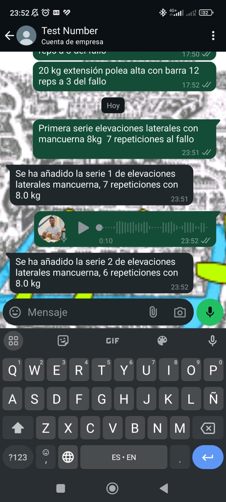

# VBT WhatsApp Training Bot

A WhatsApp bot that automatically processes and stores Velocity Based Training (VBT) via CSV or text/audio data through WhatsApp Business API, making training data collection and analysis effortless. 

## What is Velocity Based Training (VBT)?

Velocity Based Training is a method that uses movement speed to optimize resistance training. By measuring the speed of exercise execution, athletes and trainers can:

- **Autoregulate Training Load**: Rather than using fixed percentages of 1RM (one-rep maximum), VBT allows for daily load adjustment based on your actual performance capacity.
- **Objective Performance Tracking**: Movement velocity provides immediate, objective feedback about fatigue levels, readiness to train, and true intensity of the exercise.
- **Enhanced Precision**: VBT helps determine optimal loads and when to adjust training parameters.

## Current Features

### Data Collection
- ✅ Multiple input methods:
- 
    

- CSV files from VBT sensors (ADRencoder format)
- Voice messages with natural language processing

    

- Text messages with exercise parsing

    
- ✅ Real-time database storage during training
- ✅ Automatic session management

### Training Analysis
- ✅ Basic set tracking and storage
- ✅ Immediate feedback on recorded sets
- ✅ Session-based organization of training data

### Core Functionality
- ✅ WhatsApp webhook integration with security validation
- ✅ Message handling system for different input types
- ✅ PostgreSQL database integration
- ✅ Clean architecture implementation with domain-driven design
- ✅ Unit and integration testing

## Technical Stack

- **Framework**: Flask
- **Database**: PostgreSQL with SQLAlchemy ORM
- **External APIs**: 
  - WhatsApp Business API
  - OpenAI API (for audio transcription and text parsing)
- **Testing**: pytest
- **Language Processing**: Custom exercise parser using OpenAI

## Project Structure

The project follows a clean architecture pattern with the following layers:

- **Domain**: Core business logic and entities
- **Service Layer**: Orchestration and use cases
- **Adapters**: Database, WhatsApp API, and external services integration
- **Entrypoints**: Flask API endpoints

## Usage

The bot supports three ways to log training sets:

1. **CSV Upload**: Send a CSV file from your VBT sensor
   - Automatically processes velocity metrics
   - Stores complete set data including velocity, power, and distance metrics

2. **Voice Message**: Record your set details
   - Example: "Third set of bench press, 5 reps with 100kg at RPE 8"
   - Natural language processing extracts exercise, sets, reps, and weight
   - Supports Spanish language

3. **Text Message**: Type your set details
   - Same capabilities as voice messages
   - Flexible input format
   - Immediate parsing and feedback

The bot will automatically:
- Process any input method
- Store the data
- Send confirmation with set details

## Development Status

Currently implemented:
- ✅ Basic WhatsApp webhook integration
- ✅ Multi-modal data input processing (CSV, voice, text)
- ✅ Audio transcription with OpenAI
- ✅ Natural language parsing for exercise data
- ✅ Database storage
- ✅ Session management
- ✅ Testing framework

## Next Steps

### Architecture Enhancement
- 🔄 Transition to full event-driven architecture
  - Implementation of event sourcing
  - Message bus integration
  - Improved scalability and reliability
  - Better handling of asynchronous operations

### Performance Analytics
- 🔄 Data-driven insights extraction
  - Training volume analysis
  - Progress tracking over time
  - Performance patterns identification
  - Personal records tracking
  - Volume per muscular group analysis
  - Exercise-specific analytics

### Fatigue Management
- 🔄 VBT-based fatigue tracking
  - Velocity loss monitoring during sets
  - Session-to-session velocity comparison
  - Readiness assessment based on initial set velocities
  - Fatigue-based training recommendations
  - Recovery tracking

### User Experience
- 🔄 Enhanced feedback system
- 🔄 Customizable reporting
- 🔄 Training program integration

## Contributing

The project is currently in active development. For contribution guidelines, please contact the repository owner.

## License

[License information to be added]

